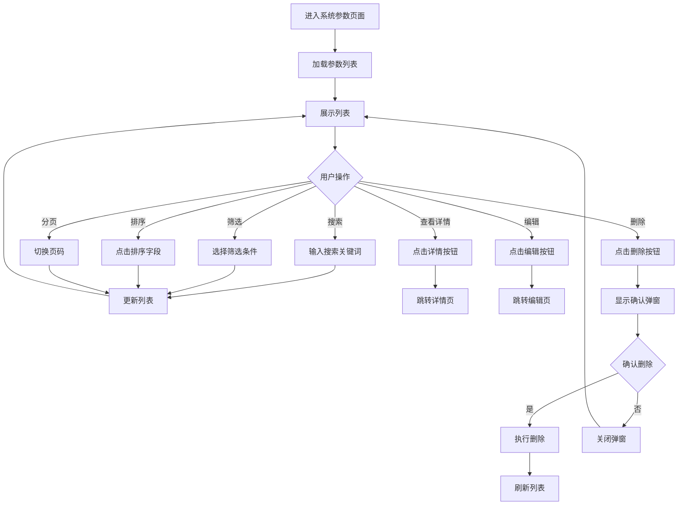
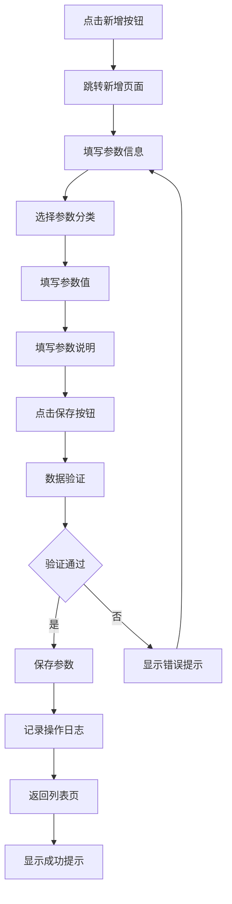
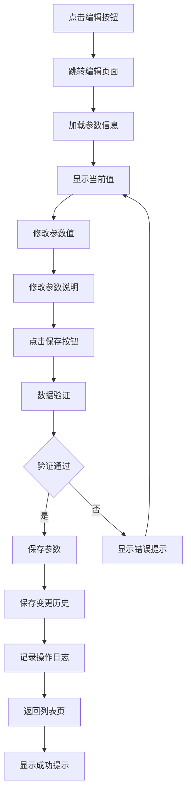
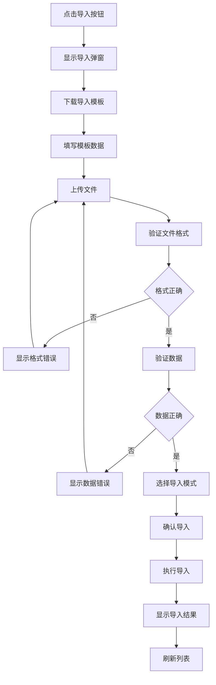
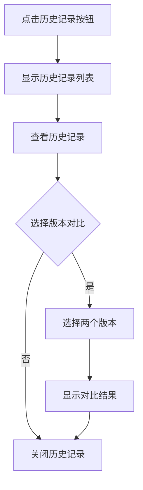

# 系统参数功能产品需求文档（PRD）

## 文档信息
- **版本**: 1.0.0
- **创建日期**: 2026-02-26
- **产品负责人**: 产品规划师
- **文档状态**: 待评审

---

## 目录
1. [产品概述](#1-产品概述)
2. [用户故事和用例](#2-用户故事和用例)
3. [功能需求清单](#3-功能需求清单)
4. [交互流程设计](#4-交互流程设计)
5. [界面原型描述](#5-界面原型描述)
6. [数据模型定义](#6-数据模型定义)
7. [验收标准](#7-验收标准)
8. [风险和依赖](#8-风险和依赖)

---

## 1. 产品概述

### 1.1 产品背景
系统参数是蓝领智汇平台系统管理模块的核心功能之一，用于集中管理平台运行所需的各种配置参数。当前系统参数功能仅实现了基础的列表展示和编辑功能，无法满足实际业务需求。需要完善系统参数功能，提供完整的参数管理能力。

### 1.2 产品目标
- 提供统一的系统参数管理界面，方便管理员配置和维护系统参数
- 支持参数的分类管理，提高参数查找和管理效率
- 确保参数修改的安全性和可追溯性
- 提供参数的导入导出功能，方便批量管理
- 支持参数的版本管理，记录参数变更历史

### 1.3 价值主张
- **提高管理效率**：统一的参数管理界面，减少管理员操作复杂度
- **降低配置错误**：通过参数分类、验证规则等功能，降低配置错误率
- **增强可追溯性**：完整的操作记录和变更历史，方便问题排查和审计
- **提升灵活性**：支持批量导入导出，方便系统迁移和备份

### 1.4 目标用户
- **平台管理员**：负责平台整体配置和管理
- **劳务公司管理员**：负责本公司系统参数配置
- **工厂管理员**：负责本工厂系统参数配置

### 1.5 使用场景
1. **系统初始化配置**：系统首次部署时，配置基础系统参数
2. **业务规则调整**：根据业务变化调整相关参数配置
3. **系统优化调整**：根据系统运行情况优化参数配置
4. **参数批量导入**：从其他系统迁移参数配置
5. **参数备份恢复**：定期备份参数配置，需要时恢复

---

## 2. 用户故事和用例

### 2.1 用户故事

#### US-001: 管理员查看系统参数列表
**作为** 平台管理员
**我想要** 查看所有系统参数的列表
**以便** 了解当前系统的配置情况

**验收标准**:
- 能够查看参数名称、参数编码、参数值、参数说明、更新时间、更新人
- 支持按参数名称、参数编码进行搜索
- 支持按参数分类进行筛选
- 支持按更新时间进行排序
- 支持分页展示，每页可自定义显示条数

#### US-002: 管理员新增系统参数
**作为** 平台管理员
**我想要** 新增系统参数
**以便** 添加新的配置项到系统中

**验收标准**:
- 能够填写参数名称、参数编码、参数值、参数说明、参数分类
- 参数编码必须唯一，系统自动校验
- 参数名称不能为空
- 根据参数类型自动应用验证规则（数字、文本、布尔值等）
- 新增成功后自动记录操作日志

#### US-003: 管理员编辑系统参数
**作为** 平台管理员
**我想要** 编辑现有系统参数
**以便** 调整系统配置

**验收标准**:
- 能够修改参数值、参数说明
- 参数编码不允许修改（确保系统稳定性）
- 修改参数值时显示确认提示
- 修改成功后自动记录操作日志和变更历史
- 支持查看参数的历史版本

#### US-004: 管理员删除系统参数
**作为** 平台管理员
**我想要** 删除不需要的系统参数
**以便** 清理无效配置

**验收标准**:
- 删除前显示二次确认弹窗
- 系统核心参数不允许删除（标记为系统级参数）
- 删除成功后自动记录操作日志
- 删除操作需要管理员权限

#### US-005: 管理员批量导入系统参数
**作为** 平台管理员
**我想要** 批量导入系统参数
**以便** 快速完成系统初始化或迁移

**验收标准**:
- 支持Excel文件导入
- 提供标准导入模板下载
- 导入前进行数据验证，显示验证结果
- 支持覆盖模式（覆盖已有参数）和追加模式（仅新增参数）
- 导入成功后显示导入结果统计

#### US-006: 管理员批量导出系统参数
**作为** 平台管理员
**我想要** 批量导出系统参数
**以便** 备份或迁移配置

**验收标准**:
- 支持导出所有参数或筛选后的参数
- 导出格式为Excel文件
- 导出文件包含参数的所有字段信息
- 支持按分类导出

#### US-007: 管理员查看参数变更历史
**作为** 平台管理员
**我想要** 查看参数的变更历史
**以便** 了解参数的修改记录和回溯问题

**验收标准**:
- 能够查看参数的修改历史记录
- 显示修改时间、修改人、修改前值、修改后值
- 支持按时间范围筛选历史记录
- 支持参数版本对比

#### US-008: 管理员配置参数分类
**作为** 平台管理员
**我想要** 配置参数分类
**以便** 更好地组织和管理参数

**验收标准**:
- 能够新增、编辑、删除参数分类
- 分类名称不能重复
- 支持分类的启用/禁用
- 删除分类前检查是否有参数使用该分类

### 2.2 用例图

#### UC-001: 查看系统参数列表
**参与者**: 管理员
**前置条件**: 用户已登录，具有系统参数查看权限
**基本流程**:
1. 用户进入系统参数页面
2. 系统展示参数列表
3. 用户使用搜索或筛选功能
4. 系统更新列表展示
5. 用户点击排序功能
6. 系统按指定字段排序
7. 用户切换分页
8. 系统加载对应页数据

**扩展流程**:
- 4a. 搜索无结果：系统显示空数据提示
- 4b. 筛选无结果：系统显示空数据提示

#### UC-002: 新增系统参数
**参与者**: 管理员
**前置条件**: 用户已登录，具有系统参数新增权限
**基本流程**:
1. 用户点击"新增参数"按钮
2. 系统跳转到新增页面
3. 用户填写参数信息
4. 用户点击"保存"按钮
5. 系统验证数据
6. 系统保存参数
7. 系统记录操作日志
8. 系统返回列表页
9. 系统显示成功提示

**扩展流程**:
- 5a. 参数编码重复：系统提示错误，用户修改后重新提交
- 5b. 必填项未填：系统提示错误，用户补充后重新提交
- 5c. 参数值格式错误：系统提示错误，用户修改后重新提交

#### UC-003: 编辑系统参数
**参与者**: 管理员
**前置条件**: 用户已登录，具有系统参数编辑权限
**基本流程**:
1. 用户点击参数的"编辑"按钮
2. 系统跳转到编辑页面
3. 系统显示当前参数信息
4. 用户修改参数值或说明
5. 用户点击"保存"按钮
6. 系统验证数据
7. 系统保存参数
8. 系统记录变更历史
9. 系统记录操作日志
10. 系统返回列表页
11. 系统显示成功提示

**扩展流程**:
- 6a. 参数值格式错误：系统提示错误，用户修改后重新提交
- 6b. 参数为系统核心参数：系统提示不允许修改

#### UC-004: 删除系统参数
**参与者**: 管理员
**前置条件**: 用户已登录，具有系统参数删除权限
**基本流程**:
1. 用户点击参数的"删除"按钮
2. 系统显示确认弹窗
3. 用户确认删除
4. 系统检查参数是否可删除
5. 系统删除参数
6. 系统记录操作日志
7. 系统刷新列表
8. 系统显示成功提示

**扩展流程**:
- 4a. 参数为系统核心参数：系统提示不允许删除
- 4b. 用户取消删除：系统关闭弹窗

#### UC-005: 批量导入系统参数
**参与者**: 管理员
**前置条件**: 用户已登录，具有系统参数导入权限
**基本流程**:
1. 用户点击"导入"按钮
2. 系统显示导入弹窗
3. 用户下载导入模板
4. 用户填写模板数据
5. 用户上传文件
6. 系统验证文件格式
7. 系统验证数据
8. 用户选择导入模式（覆盖/追加）
9. 用户确认导入
10. 系统执行导入
11. 系统显示导入结果
12. 系统刷新列表

**扩展流程**:
- 6a. 文件格式错误：系统提示错误，用户重新上传
- 7a. 数据验证失败：系统显示错误详情，用户修改后重新上传
- 10a. 导入失败：系统显示失败原因

#### UC-006: 批量导出系统参数
**参与者**: 管理员
**前置条件**: 用户已登录，具有系统参数导出权限
**基本流程**:
1. 用户选择导出范围（全部/筛选结果）
2. 用户点击"导出"按钮
3. 系统生成Excel文件
4. 系统下载文件
5. 系统显示成功提示

#### UC-007: 查看参数变更历史
**参与者**: 管理员
**前置条件**: 用户已登录，具有系统参数查看权限
**基本流程**:
1. 用户点击参数的"历史记录"按钮
2. 系统显示变更历史列表
3. 用户查看历史记录
4. 用户选择两个版本进行对比
5. 系统显示版本对比结果

---

## 3. 功能需求清单

### 3.1 功能优先级定义
- **P0 - 必须有**（Must Have）：核心功能，必须实现
- **P1 - 应该有**（Should Have）：重要功能，应该实现
- **P2 - 可以有**（Could Have）：增强功能，可以延后实现
- **P3 - 不会有**（Won't Have）：暂不实现的功能

### 3.2 功能需求列表

#### 3.2.1 列表页面功能（P0）
| 需求编号 | 需求名称 | 优先级 | 描述 |
|----------|----------|--------|------|
| FR-001 | 参数列表展示 | P0 | 以表格形式展示系统参数列表，支持分页 |
| FR-002 | 参数搜索功能 | P0 | 支持按参数名称、参数编码进行搜索 |
| FR-003 | 参数筛选功能 | P0 | 支持按参数分类、参数类型进行筛选 |
| FR-004 | 参数排序功能 | P0 | 支持按更新时间、参数名称进行排序 |
| FR-005 | 列表字段自定义 | P1 | 支持用户自定义列表显示字段和顺序 |
| FR-006 | 自定义列表管理 | P1 | 支持创建、编辑、删除自定义列表配置 |
| FR-007 | 列表列宽调整 | P1 | 支持拖拽调整列宽 |
| FR-008 | 悬浮提示功能 | P1 | 鼠标悬停显示完整信息 |
| FR-009 | 文本截断功能 | P1 | 超长文本以...显示 |

#### 3.2.2 参数管理功能（P0）
| 需求编号 | 需求名称 | 优先级 | 描述 |
|----------|----------|--------|------|
| FR-010 | 新增参数 | P0 | 支持新增系统参数 |
| FR-011 | 编辑参数 | P0 | 支持编辑系统参数 |
| FR-012 | 删除参数 | P0 | 支持删除系统参数，带二次确认 |
| FR-013 | 参数详情查看 | P0 | 支持查看参数详细信息 |
| FR-014 | 参数批量删除 | P1 | 支持选中多个参数批量删除 |
| FR-015 | 参数复制功能 | P2 | 支持复制现有参数创建新参数 |

#### 3.2.3 参数分类管理功能（P1）
| 需求编号 | 需求名称 | 优先级 | 描述 |
|----------|----------|--------|------|
| FR-016 | 分类列表管理 | P1 | 支持参数分类的增删改查 |
| FR-017 | 分类树状展示 | P1 | 以树状结构展示参数分类 |
| FR-018 | 分类启用/禁用 | P1 | 支持分类的启用和禁用 |

#### 3.2.4 导入导出功能（P1）
| 需求编号 | 需求名称 | 优先级 | 描述 |
|----------|----------|--------|------|
| FR-019 | 参数导入 | P1 | 支持Excel文件批量导入参数 |
| FR-020 | 参数导出 | P1 | 支持导出参数到Excel文件 |
| FR-021 | 导入模板下载 | P1 | 提供标准导入模板下载 |
| FR-022 | 导入数据验证 | P1 | 导入前进行数据验证 |
| FR-023 | 导入模式选择 | P1 | 支持覆盖模式和追加模式 |
| FR-024 | 导入结果展示 | P1 | 显示导入成功和失败的统计 |

#### 3.2.5 变更历史功能（P1）
| 需求编号 | 需求名称 | 优先级 | 描述 |
|----------|----------|--------|------|
| FR-025 | 变更历史记录 | P1 | 记录参数的修改历史 |
| FR-026 | 历史记录查看 | P1 | 支持查看参数的变更历史 |
| FR-027 | 版本对比功能 | P1 | 支持对比不同版本的参数值 |
| FR-028 | 历史记录筛选 | P1 | 支持按时间范围筛选历史记录 |

#### 3.2.6 操作日志功能（P1）
| 需求编号 | 需求名称 | 优先级 | 描述 |
|----------|----------|--------|------|
| FR-029 | 操作日志记录 | P1 | 记录所有参数操作日志 |
| FR-030 | 操作日志查看 | P1 | 支持查看操作日志 |
| FR-031 | 日志筛选功能 | P1 | 支持按操作类型、操作人、时间筛选 |

#### 3.2.7 数据权限功能（P0）
| 需求编号 | 需求名称 | 优先级 | 描述 |
|----------|----------|--------|------|
| FR-032 | 数据权限过滤 | P0 | 根据用户岗位的数据权限过滤参数数据 |
| FR-033 | 操作权限控制 | P0 | 根据用户权限控制增删改查操作 |

#### 3.2.8 参数验证功能（P0）
| 需求编号 | 需求名称 | 优先级 | 描述 |
|----------|----------|--------|------|
| FR-034 | 参数编码唯一性 | P0 | 确保参数编码唯一 |
| FR-035 | 参数值格式验证 | P0 | 根据参数类型验证参数值格式 |
| FR-036 | 必填项验证 | P0 | 验证必填字段是否填写 |
| FR-037 | 系统参数保护 | P0 | 系统核心参数不允许删除或修改编码 |

---

## 4. 交互流程设计

### 4.1 查看参数列表流程

### 4.2 新增参数流程

### 4.3 编辑参数流程

### 4.4 批量导入流程

### 4.5 查看变更历史流程

---

## 5. 界面原型描述

### 5.1 列表页面设计

#### 5.1.1 页面布局
- **页面标签栏**：显示"系统参数"标签
- **查询条件区域**：
  - 参数名称（文本输入框）
  - 参数编码（文本输入框）
  - 参数分类（下拉选择框）
  - 参数类型（下拉选择框：文本、数字、布尔值、日期、JSON）
  - 查询按钮
  - 重置按钮
- **功能按钮栏**：
  - 新增按钮（主要操作）
  - 导入按钮
  - 导出按钮
  - 批量删除按钮（选中数据后启用）
- **列表区域**：
  - 使用CommonTable组件
  - 支持列宽调整、排序、筛选、多选
- **分页区域**：
  - 显示总记录数
  - 分页控件
  - 每页显示条数选择器

#### 5.1.2 列表字段配置
| 字段名称 | 字段编码 | 宽度 | 可排序 | 可筛选 | 说明 |
|----------|----------|------|--------|--------|------|
| 参数名称 | name | 150px | 是 | 是 | 参数的显示名称 |
| 参数编码 | code | 180px | 是 | 是 | 参数的唯一标识 |
| 参数分类 | category | 120px | 是 | 是 | 参数所属分类 |
| 参数类型 | type | 100px | 是 | 是 | 参数值的数据类型 |
| 参数值 | value | 200px | 否 | 否 | 参数的当前值 |
| 参数说明 | description | 250px | 否 | 否 | 参数的详细说明 |
| 更新时间 | updateTime | 160px | 是 | 否 | 最后更新时间 |
| 更新人 | updater | 120px | 是 | 否 | 最后更新人 |
| 操作 | action | 150px | 否 | 否 | 操作按钮 |

#### 5.1.3 操作按钮配置
- **查看**：跳转到详情页面
- **编辑**：跳转到编辑页面
- **删除**：弹出确认对话框，确认后删除
- **历史记录**：弹出历史记录对话框

### 5.2 新增/编辑页面设计

#### 5.2.1 页面布局
- **页面标签栏**：显示"新增参数"或"编辑参数"标签
- **表单区域**：
  - 使用CommonForm组件
  - 分为基本信息和扩展信息两个分组
- **操作按钮栏**：
  - 保存按钮
  - 取消按钮

#### 5.2.2 表单字段配置

**基本信息分组**：
| 字段名称 | 字段编码 | 字段类型 | 必填 | 验证规则 | 说明 |
|----------|----------|----------|------|----------|------|
| 参数名称 | name | TEXT | 是 | 长度1-100 | 参数的显示名称 |
| 参数编码 | code | TEXT | 是 | 长度1-50，字母数字下划线，唯一 | 参数的唯一标识，新增时可填，编辑时不可修改 |
| 参数分类 | categoryId | SELECT | 是 | 必须选择有效分类 | 参数所属分类 |
| 参数类型 | type | SELECT | 是 | 文本/数字/布尔值/日期/JSON | 参数值的数据类型 |
| 参数值 | value | 根据类型动态 | 是 | 根据类型验证 | 参数的当前值 |
| 参数说明 | description | TEXTAREA | 否 | 长度0-500 | 参数的详细说明 |

**扩展信息分组**：
| 字段名称 | 字段编码 | 字段类型 | 必填 | 验证规则 | 说明 |
|----------|----------|----------|------|----------|------|
| 是否系统参数 | isSystem | RADIO | 是 | 是/否 | 系统核心参数不允许删除 |
| 默认值 | defaultValue | 根据类型动态 | 否 | 根据类型验证 | 参数的默认值 |
| 最小值 | minValue | NUMBER | 否 | 仅数字类型 | 参数的最小值 |
| 最大值 | maxValue | NUMBER | 否 | 仅数字类型 | 参数的最大值 |
| 正则表达式 | regex | TEXT | 否 | 有效正则表达式 | 参数值的正则验证规则 |

#### 5.2.3 参数值输入控件
- **文本类型**：单行文本输入框
- **数字类型**：数字输入框，支持最小值和最大值验证
- **布尔值类型**：单选按钮组（是/否）
- **日期类型**：日期时间选择器
- **JSON类型**：代码编辑器，支持JSON格式验证

### 5.3 详情页面设计

#### 5.3.1 页面布局
- **页面标签栏**：显示"参数详情"标签
- **信息展示区域**：
  - 使用CommonDetail组件
  - 分为基本信息、扩展信息、变更历史三个分组
- **操作按钮栏**：
  - 编辑按钮
  - 返回按钮

#### 5.3.2 信息分组展示

**基本信息分组**：
- 参数名称
- 参数编码
- 参数分类
- 参数类型
- 参数值
- 参数说明

**扩展信息分组**：
- 是否系统参数
- 默认值
- 最小值
- 最大值
- 正则表达式
- 创建时间
- 创建人
- 更新时间
- 更新人

**变更历史分组**：
- 时间线展示变更历史
- 每条记录显示：变更时间、变更人、变更字段、变更前值、变更后值

### 5.4 导入弹窗设计

#### 5.4.1 弹窗布局
- **标题**：导入系统参数
- **内容区域**：
  - 下载模板按钮
  - 文件上传区域
  - 导入模式选择（覆盖模式/追加模式）
  - 导入结果展示区域
- **操作按钮**：
  - 确认导入按钮
  - 取消按钮

#### 5.4.2 导入结果展示
- 成功导入数量
- 失败导入数量
- 失败原因列表
- 关闭按钮

### 5.5 历史记录弹窗设计

#### 5.5.1 弹窗布局
- **标题**：参数变更历史
- **内容区域**：
  - 历史记录列表（表格）
  - 版本对比区域
- **操作按钮**：
  - 关闭按钮

#### 5.5.2 历史记录列表字段
| 字段名称 | 说明 |
|----------|------|
| 变更时间 | 参数变更的时间 |
| 变更人 | 执行变更操作的用户 |
| 变更类型 | 新增/修改/删除 |
| 变更字段 | 变更的字段名称 |
| 变更前值 | 变更前的值 |
| 变更后值 | 变更后的值 |

### 5.6 分类管理页面设计

#### 5.6.1 页面布局
- **页面标签栏**：显示"参数分类"标签
- **左侧树状结构**：展示参数分类树
- **右侧内容区域**：
  - 新增分类按钮
  - 分类列表（表格）
  - 编辑/删除操作按钮

#### 5.6.2 分类列表字段
| 字段名称 | 字段编码 | 宽度 | 说明 |
|----------|----------|------|------|
| 分类名称 | name | 150px | 分类显示名称 |
| 分类编码 | code | 180px | 分类唯一标识 |
| 上级分类 | parentId | 150px | 父分类名称 |
| 排序号 | sortOrder | 100px | 分类排序 |
| 状态 | status | 100px | 启用/禁用 |
| 创建时间 | createTime | 160px | 创建时间 |
| 操作 | action | 150px | 编辑/删除按钮 |

---

## 6. 数据模型定义

### 6.1 系统参数表（system_parameter）

| 字段名称 | 字段编码 | 数据类型 | 长度 | 必填 | 默认值 | 说明 |
|----------|----------|----------|------|------|--------|------|
| 主键ID | id | BIGINT | - | 是 | 自增 | 主键 |
| 参数名称 | name | VARCHAR | 100 | 是 | - | 参数显示名称 |
| 参数编码 | code | VARCHAR | 50 | 是 | - | 参数唯一标识，全局唯一 |
| 参数分类ID | categoryId | BIGINT | - | 是 | - | 关联参数分类表 |
| 参数类型 | type | VARCHAR | 20 | 是 | - | TEXT/NUMBER/BOOLEAN/DATE/JSON |
| 参数值 | value | TEXT | - | 是 | - | 参数当前值 |
| 参数说明 | description | VARCHAR | 500 | 否 | - | 参数详细说明 |
| 是否系统参数 | isSystem | TINYINT | 1 | 是 | 0 | 0-否，1-是 |
| 默认值 | defaultValue | TEXT | - | 否 | - | 参数默认值 |
| 最小值 | minValue | DECIMAL | 10,2 | 否 | - | 仅数字类型有效 |
| 最大值 | maxValue | DECIMAL | 10,2 | 否 | - | 仅数字类型有效 |
| 正则表达式 | regex | VARCHAR | 200 | 否 | - | 参数值验证正则 |
| 排序号 | sortOrder | INT | - | 是 | 0 | 参数排序 |
| 状态 | status | TINYINT | 1 | 是 | 1 | 0-禁用，1-启用 |
| 租户ID | tenantId | BIGINT | - | 是 | - | 租户隔离 |
| 创建人ID | creatorId | BIGINT | - | 是 | - | 创建人ID |
| 创建时间 | createTime | DATETIME | - | 是 | CURRENT_TIMESTAMP | 创建时间 |
| 更新人ID | updaterId | BIGINT | - | 否 | - | 更新人ID |
| 更新时间 | updateTime | DATETIME | - | 是 | CURRENT_TIMESTAMP ON UPDATE | 更新时间 |
| 删除标记 | deleted | TINYINT | 1 | 是 | 0 | 0-未删除，1-已删除 |

**索引**：
- PRIMARY KEY (id)
- UNIQUE KEY uk_code_tenant (code, tenantId)
- INDEX idx_categoryId (categoryId)
- INDEX idx_status (status)
- INDEX idx_tenantId (tenantId)

### 6.2 参数分类表（system_parameter_category）

| 字段名称 | 字段编码 | 数据类型 | 长度 | 必填 | 默认值 | 说明 |
|----------|----------|----------|------|------|--------|------|
| 主键ID | id | BIGINT | - | 是 | 自增 | 主键 |
| 分类名称 | name | VARCHAR | 50 | 是 | - | 分类显示名称 |
| 分类编码 | code | VARCHAR | 50 | 是 | - | 分类唯一标识 |
| 上级分类ID | parentId | BIGINT | - | 否 | 0 | 0-顶级分类 |
| 分类层级 | level | INT | - | 是 | 1 | 分类层级 |
| 分类路径 | path | VARCHAR | 200 | 是 | - | 分类路径，如：1/2/3 |
| 分类说明 | description | VARCHAR | 200 | 否 | - | 分类说明 |
| 排序号 | sortOrder | INT | - | 是 | 0 | 分类排序 |
| 状态 | status | TINYINT | 1 | 是 | 1 | 0-禁用，1-启用 |
| 租户ID | tenantId | BIGINT | - | 是 | - | 租户隔离 |
| 创建人ID | creatorId | BIGINT | - | 是 | - | 创建人ID |
| 创建时间 | createTime | DATETIME | - | 是 | CURRENT_TIMESTAMP | 创建时间 |
| 更新人ID | updaterId | BIGINT | - | 否 | - | 更新人ID |
| 更新时间 | updateTime | DATETIME | - | 是 | CURRENT_TIMESTAMP ON UPDATE | 更新时间 |
| 删除标记 | deleted | TINYINT | 1 | 是 | 0 | 0-未删除，1-已删除 |

**索引**：
- PRIMARY KEY (id)
- UNIQUE KEY uk_code_tenant (code, tenantId)
- INDEX idx_parentId (parentId)
- INDEX idx_status (status)
- INDEX idx_tenantId (tenantId)

### 6.3 参数变更历史表（system_parameter_history）

| 字段名称 | 字段编码 | 数据类型 | 长度 | 必填 | 默认值 | 说明 |
|----------|----------|----------|------|------|--------|------|
| 主键ID | id | BIGINT | - | 是 | 自增 | 主键 |
| 参数ID | parameterId | BIGINT | - | 是 | - | 关联系统参数表 |
| 变更类型 | changeType | VARCHAR | 20 | 是 | - | CREATE/UPDATE/DELETE |
| 变更字段 | fieldName | VARCHAR | 50 | 是 | - | 变更的字段名称 |
| 变更前值 | oldValue | TEXT | - | 否 | - | 变更前的值 |
| 变更后值 | newValue | TEXT | - | 否 | - | 变更后的值 |
| 版本号 | version | INT | - | 是 | 1 | 参数版本号 |
| 变更人ID | changerId | BIGINT | - | 是 | - | 变更人ID |
| 变更人姓名 | changerName | VARCHAR | 50 | 是 | - | 变更人姓名 |
| 变更时间 | changeTime | DATETIME | - | 是 | CURRENT_TIMESTAMP | 变更时间 |
| 变更说明 | remark | VARCHAR | 200 | 否 | - | 变更说明 |
| 租户ID | tenantId | BIGINT | - | 是 | - | 租户隔离 |

**索引**：
- PRIMARY KEY (id)
- INDEX idx_parameterId (parameterId)
- INDEX idx_changeTime (changeTime)
- INDEX idx_tenantId (tenantId)

### 6.4 操作日志表（system_operation_log）

| 字段名称 | 字段编码 | 数据类型 | 长度 | 必填 | 默认值 | 说明 |
|----------|----------|----------|------|------|--------|------|
| 主键ID | id | BIGINT | - | 是 | 自增 | 主键 |
| 操作模块 | module | VARCHAR | 50 | 是 | - | 操作模块名称 |
| 操作类型 | operationType | VARCHAR | 20 | 是 | - | CREATE/UPDATE/DELETE/IMPORT/EXPORT |
| 操作内容 | content | TEXT | - | 是 | - | 操作内容描述 |
| 操作人ID | operatorId | BIGINT | - | 是 | - | 操作人ID |
| 操作人姓名 | operatorName | VARCHAR | 50 | 是 | - | 操作人姓名 |
| 操作IP | ip | VARCHAR | 50 | 是 | - | 操作IP地址 |
| 操作结果 | result | VARCHAR | 20 | 是 | - | SUCCESS/FAILURE |
| 失败原因 | failureReason | VARCHAR | 500 | 否 | - | 失败原因 |
| 操作时间 | operationTime | DATETIME | - | 是 | CURRENT_TIMESTAMP | 操作时间 |
| 租户ID | tenantId | BIGINT | - | 是 | - | 租户隔离 |

**索引**：
- PRIMARY KEY (id)
- INDEX idx_module (module)
- INDEX idx_operationType (operationType)
- INDEX idx_operatorId (operatorId)
- INDEX idx_operationTime (operationTime)
- INDEX idx_tenantId (tenantId)

### 6.5 数据字典表（system_dictionary）

| 字段名称 | 字段编码 | 数据类型 | 长度 | 必填 | 默认值 | 说明 |
|----------|----------|----------|------|------|--------|------|
| 主键ID | id | BIGINT | - | 是 | 自增 | 主键 |
| 字典名称 | name | VARCHAR | 50 | 是 | - | 字典显示名称 |
| 字典类型 | type | VARCHAR | 50 | 是 | - | 字典类型 |
| 字典编码 | code | VARCHAR | 50 | 是 | - | 字典编码 |
| 字典值 | value | VARCHAR | 100 | 是 | - | 字典值 |
| 字典说明 | description | VARCHAR | 200 | 否 | - | 字典说明 |
| 排序号 | sortOrder | INT | - | 是 | 0 | 字典排序 |
| 状态 | status | TINYINT | 1 | 是 | 1 | 0-禁用，1-启用 |
| 租户ID | tenantId | BIGINT | - | 是 | - | 租户隔离 |
| 创建时间 | createTime | DATETIME | - | 是 | CURRENT_TIMESTAMP | 创建时间 |
| 更新时间 | updateTime | DATETIME | - | 是 | CURRENT_TIMESTAMP ON UPDATE | 更新时间 |

**索引**：
- PRIMARY KEY (id)
- UNIQUE KEY uk_type_code_tenant (type, code, tenantId)
- INDEX idx_status (status)
- INDEX idx_tenantId (tenantId)

### 6.6 数据字典初始化

#### 6.6.1 参数类型字典
| 字典类型 | 字典编码 | 字典值 | 字典名称 | 排序号 |
|----------|----------|--------|----------|--------|
| PARAMETER_TYPE | TEXT | TEXT | 文本 | 1 |
| PARAMETER_TYPE | NUMBER | NUMBER | 数字 | 2 |
| PARAMETER_TYPE | BOOLEAN | BOOLEAN | 布尔值 | 3 |
| PARAMETER_TYPE | DATE | DATE | 日期 | 4 |
| PARAMETER_TYPE | JSON | JSON | JSON | 5 |

#### 6.6.2 参数分类初始化数据
| 分类名称 | 分类编码 | 上级分类ID | 分类层级 | 排序号 |
|----------|----------|------------|----------|--------|
| 基础配置 | BASIC_CONFIG | 0 | 1 | 1 |
| 业务配置 | BUSINESS_CONFIG | 0 | 1 | 2 |
| 系统配置 | SYSTEM_CONFIG | 0 | 1 | 3 |
| 安全配置 | SECURITY_CONFIG | 0 | 1 | 4 |

#### 6.6.3 系统参数初始化数据
| 参数名称 | 参数编码 | 参数分类ID | 参数类型 | 参数值 | 是否系统参数 |
|----------|----------|------------|----------|--------|------------|
| 系统名称 | system_name | 1 | TEXT | 蓝领智汇 | 1 |
| 系统版本 | system_version | 1 | TEXT | 1.0.0 | 1 |
| 默认每页条数 | default_page_size | 1 | NUMBER | 20 | 0 |
| 最大上传大小 | max_upload_size | 1 | NUMBER | 10 | 0 |
| 会话超时时间 | session_timeout | 1 | NUMBER | 30 | 0 |

---

## 7. 验收标准

### 7.1 功能验收标准

#### 7.1.1 列表页面验收
- [ ] 能够正常加载并展示系统参数列表
- [ ] 搜索功能能够正确过滤数据
- [ ] 筛选功能能够正确过滤数据
- [ ] 排序功能能够正确排序数据
- [ ] 分页功能能够正确切换页码
- [ ] 列表字段能够正确显示数据
- [ ] 列宽调整功能能够正常工作
- [ ] 悬浮提示能够正确显示完整信息
- [ ] 文本截断功能能够正确截断超长文本
- [ ] 自定义列表功能能够正常创建、编辑、删除
- [ ] 字段显示设置能够正常保存和加载

#### 7.1.2 参数管理验收
- [ ] 能够正常新增系统参数
- [ ] 参数编码唯一性验证能够正常工作
- [ ] 参数值格式验证能够正常工作
- [ ] 必填项验证能够正常工作
- [ ] 能够正常编辑系统参数
- [ ] 编辑时参数编码不允许修改
- [ ] 系统核心参数不允许删除
- [ ] 删除操作能够正确弹出确认对话框
- [ ] 删除操作能够正确记录操作日志
- [ ] 批量删除功能能够正常工作

#### 7.1.3 参数分类管理验收
- [ ] 能够正常新增参数分类
- [ ] 分类编码唯一性验证能够正常工作
- [ ] 能够正常编辑参数分类
- [ ] 能够正常删除参数分类
- [ ] 删除分类前检查是否有参数使用该分类
- [ ] 分类树状结构能够正确展示
- [ ] 分类启用/禁用功能能够正常工作

#### 7.1.4 导入导出验收
- [ ] 能够正常下载导入模板
- [ ] 能够正常上传Excel文件
- [ ] 文件格式验证能够正常工作
- [ ] 数据验证能够正常工作
- [ ] 导入模式选择能够正常工作
- [ ] 覆盖模式能够正确覆盖已有参数
- [ ] 追加模式能够正确新增参数
- [ ] 导入结果能够正确展示
- [ ] 能够正常导出参数到Excel文件
- [ ] 导出文件包含所有必要字段

#### 7.1.5 变更历史验收
- [ ] 参数变更能够正确记录到历史表
- [ ] 能够正常查看参数变更历史
- [ ] 变更历史能够正确显示变更时间、变更人、变更字段、变更前值、变更后值
- [ ] 版本对比功能能够正常工作
- [ ] 历史记录筛选功能能够正常工作

#### 7.1.6 操作日志验收
- [ ] 所有参数操作能够正确记录到操作日志
- [ ] 能够正常查看操作日志
- [ ] 操作日志能够正确显示操作模块、操作类型、操作内容、操作人、操作时间
- [ ] 操作日志筛选功能能够正常工作

#### 7.1.7 数据权限验收
- [ ] 根据用户岗位的数据权限能够正确过滤参数数据
- [ ] 根据用户权限能够正确控制增删改查操作
- [ ] 全部数据权限能够查看所有参数
- [ ] 本部门数据权限能够查看本部门参数
- [ ] 本人数据权限能够查看自己创建的参数
- [ ] 自定义数据权限能够查看指定部门的参数

### 7.2 性能验收标准
- [ ] 列表页面加载时间不超过2秒
- [ ] 搜索响应时间不超过1秒
- [ ] 新增/编辑操作响应时间不超过1秒
- [ ] 导入1000条数据时间不超过30秒
- [ ] 导出1000条数据时间不超过10秒
- [ ] 列表分页切换响应时间不超过0.5秒

### 7.3 安全验收标准
- [ ] 所有操作需要登录验证
- [ ] 操作权限需要正确验证
- [ ] 数据权限需要正确过滤
- [ ] 参数编码需要唯一性验证
- [ ] 参数值需要格式验证
- [ ] 系统核心参数需要保护
- [ ] 操作日志需要完整记录
- [ ] 敏感操作需要二次确认

### 7.4 兼容性验收标准
- [ ] 支持Chrome浏览器最新版本
- [ ] 支持Firefox浏览器最新版本
- [ ] 支持Edge浏览器最新版本
- [ ] 支持Safari浏览器最新版本
- [ ] 支持1920x1080分辨率
- [ ] 支持1366x768分辨率
- [ ] 支持移动端响应式布局

### 7.5 用户体验验收标准
- [ ] 界面布局合理，符合设计规范
- [ ] 操作流程简单直观
- [ ] 错误提示清晰明确
- [ ] 成功提示及时反馈
- [ ] 加载状态清晰展示
- [ ] 空数据提示友好
- [ ] 表单验证及时反馈
- [ ] 操作确认提示清晰

---

## 8. 风险和依赖

### 8.1 技术风险

#### 8.1.1 参数值格式验证风险
**风险描述**: 不同类型的参数值需要不同的验证规则，验证逻辑复杂，可能存在验证漏洞。

**风险等级**: 中

**影响范围**: 参数新增、编辑功能

**应对措施**:
- 提前设计完整的参数类型和验证规则
- 编写详细的测试用例覆盖各种参数类型
- 使用成熟的验证库（如validator.js）
- 进行充分的单元测试和集成测试

#### 8.1.2 数据权限实现风险
**风险描述**: 数据权限过滤逻辑复杂，可能影响查询性能。

**风险等级**: 高

**影响范围**: 列表查询、详情查看

**应对措施**:
- 提前设计数据权限方案
- 在数据库层面进行权限过滤
- 添加必要的索引优化查询性能
- 进行性能测试，必要时进行数据库优化

#### 8.1.3 导入导出性能风险
**风险描述**: 大批量数据导入导出可能导致系统性能问题或超时。

**风险等级**: 中

**影响范围**: 导入导出功能

**应对措施**:
- 限制单次导入导出的数据量
- 使用异步处理方式
- 提供导入导出进度提示
- 进行性能测试，优化导入导出逻辑

### 8.2 业务风险

#### 8.2.1 参数误修改风险
**风险描述**: 管理员可能误修改关键参数，导致系统异常。

**风险等级**: 高

**影响范围**: 系统稳定性

**应对措施**:
- 系统核心参数标记为不可修改
- 修改参数值时显示确认提示
- 记录完整的变更历史
- 提供参数回滚功能
- 进行参数修改前验证

#### 8.2.2 参数删除风险
**风险描述**: 删除参数可能导致系统功能异常。

**风险等级**: 高

**影响范围**: 系统功能

**应对措施**:
- 系统核心参数不允许删除
- 删除前检查参数是否被使用
- 删除操作需要二次确认
- 记录完整的操作日志
- 提供参数恢复功能

### 8.3 进度风险

#### 8.3.1 开发时间不足风险
**风险描述**: 功能较多，开发时间可能不足。

**风险等级**: 中

**影响范围**: 项目进度

**应对措施**:
- 按优先级分阶段开发
- 优先实现P0和P1功能
- P2功能可以延后实现
- 必要时增加开发人员

#### 8.3.2 测试时间不足风险
**风险描述**: 测试时间不足可能导致测试覆盖率不够。

**风险等级**: 中

**影响范围**: 产品质量

**应对措施**:
- 提前制定测试计划
- 分阶段进行测试
- 自动化测试和手工测试结合
- 必要时增加测试人员

### 8.4 依赖关系

#### 8.4.1 通用组件依赖
**依赖项**: CommonTable组件、CommonForm组件、CommonDetail组件

**依赖描述**: 系统参数功能需要使用通用表格、表单、详情组件

**依赖状态**: 待开发

**应对措施**:
- 优先开发通用组件
- 通用组件开发完成后开始系统参数功能开发
- 必要时简化通用组件功能

#### 8.4.2 数据权限依赖
**依赖项**: 数据权限配置、数据权限过滤中间件

**依赖描述**: 系统参数功能需要应用数据权限

**依赖状态**: 待开发

**应对措施**:
- 优先开发数据权限功能
- 数据权限功能开发完成后集成到系统参数功能
- 必要时简化数据权限功能

#### 8.4.3 审批流程依赖
**依赖项**: 审批流程配置（系统参数不需要审批）

**依赖描述**: 系统参数不需要审批流程

**依赖状态**: 无依赖

**应对措施**: 无

#### 8.4.4 附件管理依赖
**依赖项**: 附件管理功能（系统参数不需要附件）

**依赖描述**: 系统参数不需要附件管理

**依赖状态**: 无依赖

**应对措施**: 无

#### 8.4.5 打印管理依赖
**依赖项**: 打印管理功能（系统参数不需要打印）

**依赖描述**: 系统参数不需要打印功能

**依赖状态**: 无依赖

**应对措施**: 无

### 8.5 外部依赖

#### 8.5.1 Element Plus组件库
**依赖项**: Element Plus UI组件库

**依赖描述**: 系统参数功能使用Element Plus组件

**依赖状态**: 已安装

**应对措施**: 无

#### 8.5.2 Excel处理库
**依赖项**: xlsx或exceljs库

**依赖描述**: 导入导出功能需要Excel处理库

**依赖状态**: 待安装

**应对措施**:
- 提前安装Excel处理库
- 进行技术预研
- 选择合适的Excel处理库

#### 8.5.3 正则验证库
**依赖项**: validator.js库

**依赖描述**: 参数值验证需要正则验证库

**依赖状态**: 待安装

**应对措施**:
- 提前安装验证库
- 进行技术预研
- 选择合适的验证库

### 8.6 数据依赖

#### 8.6.1 参数分类初始化数据
**依赖项**: 参数分类初始化数据

**依赖描述**: 系统参数需要参数分类数据

**依赖状态**: 待准备

**应对措施**:
- 提前准备参数分类初始化数据
- 提供参数分类管理功能
- 支持管理员自定义参数分类

#### 8.6.2 系统参数初始化数据
**依赖项**: 系统参数初始化数据

**依赖描述**: 系统需要基础系统参数

**依赖状态**: 待准备

**应对措施**:
- 提前准备系统参数初始化数据
- 提供参数导入功能
- 支持管理员自定义系统参数

---

## 附录

### A. 术语表
| 术语 | 说明 |
|------|------|
| 系统参数 | 系统运行所需的配置参数 |
| 参数编码 | 参数的唯一标识，全局唯一 |
| 参数分类 | 参数的分类，便于管理和查找 |
| 参数类型 | 参数值的数据类型 |
| 变更历史 | 参数的修改历史记录 |
| 操作日志 | 用户操作的记录 |
| 数据权限 | 用户可以查看的数据范围 |
| 覆盖模式 | 导入时覆盖已有参数 |
| 追加模式 | 导入时仅新增参数 |
| 系统核心参数 | 系统运行必需的关键参数 |

### B. 参考文档
- 《蓝领智汇平台开发规范》
- 《PC端功能说明文档》
- 《PC端UI设计规范》
- 《项目开发计划》

### C. 联系方式
- **产品负责人**: 产品规划师
- **技术负责人**: 架构师
- **前端负责人**: 前端开发师
- **后端负责人**: 后端工程师
- **测试负责人**: 功能测试工程师

---

**文档版本**: 1.0.0
**最后更新**: 2026-02-26
**下次更新**: 开发过程中根据实际情况更新
